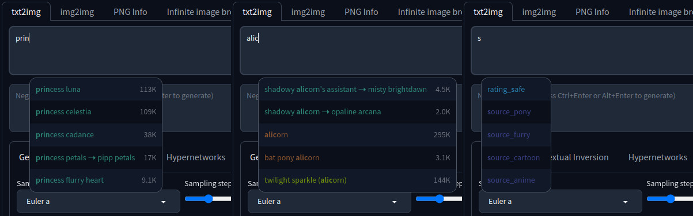
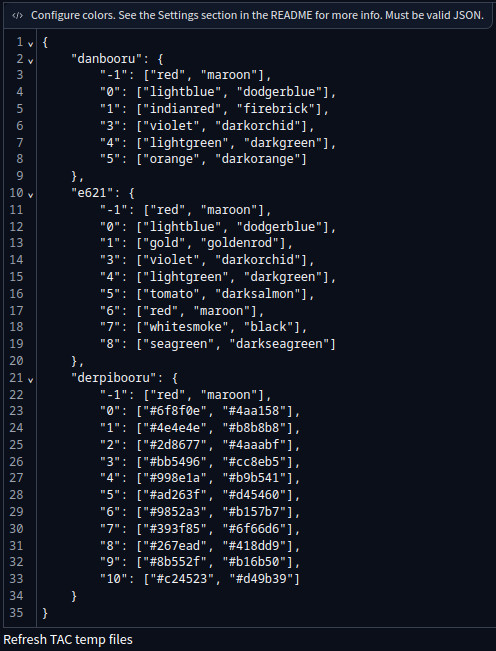

# Derpibooru Tags Autocompletion for A1111

*Tags Last Updated: 16-09-2023*


This is a plugin for [A1111 Tag Autocompletion Extension](https://github.com/DominikDoom/a1111-sd-webui-tagcomplete) that adds support for Derpibooru tags, including aliases, tag count and colors. It is intended to be used with [Pony Diffusion V5](https://civitai.com/models/95367/pony-diffusion-v5), so [unrelated tag categories](https://derpibooru.org/tags?tq=category%3Aorigin+OR+category%3Aerror+OR+category%3Aspoiler) are not included. Special Pony Diffusion tags like `source_pony` or `rating_safe` are also present.



# Installation
Head on over to the [releases](releases) page and download the latest `derpibooru.csv` file. You need to put this file into the `.../stable-diffusion-webui/extensions/a1111-sd-webui-tagcomplete/tags` directory.

Now it's time to configure the extension. Fire up your WebUI and go to `Settings -> Tag Autocomplete`. Select `derpibooru.csv` in the "Tag filename" drop-down. After you've done that, scroll all the way down until you see the big "Configure colors..." text box. Append the following section to the already existing text (don't forget to add a comma to the previous section):

```
    "derpibooru": {
        "-1": ["red", "maroon"],
        "0": ["#6f8f0e", "#4aa158"],
        "1": ["#4e4e4e", "#b8b8b8"],
        "2": ["#2d8677", "#4aaabf"],
        "3": ["#bb5496", "#cc8eb5"],
        "4": ["#998e1a", "#b9b541"],
        "5": ["#ad263f", "#d45460"],
        "6": ["#9852a3", "#b157b7"],
        "7": ["#393f85", "#6f66d6"],
        "8": ["#267ead", "#418dd9"],
        "9": ["#8b552f", "#b16b50"],
        "10": ["#c24523", "#d49b39"]
    }
```

The end result should look like this:



While you're still in the settings, you also might want to untick the `Replace underscores with spaces on insertion` option, because special Pony Diffusion tags require literal underscore.

That's it! Hit `Apply settings` at the very top and you should now have Derpibooru tags autocompletion in you prompt textboxes.
